# NameGen

Lazer kesim isim kolyesi / pendant tasarımları üreten bir web uygulaması. Müşteri bir isim yazar, stil seçer ve birbirine bağlı (tek parça) siyah-beyaz tasarımlar indirir: PNG ve SVG.

## Yaklaşım

**Asıl üretici Grok image-to-image’dir.** Font yolu yalnızca son çare yedektir. Strateji env ile kod değiştirmeden ayarlanır (maliyet: her input referansı da faturalanır; 2.0 + 2 ref ≈ $0.08/görsel).

Varsayılan (canlı maliyet testi): `grok-imagine-image-2.0`, **1 referans**, `quality=low`, **2 istek × n=2** (farklı ref), `1k`. Formül: `n × $0.04 + $0.01` / istek (ref istek başına bir kez). 4 tasarım ≈ **$0.18**. Tek istekte n=4 ≈ $0.17 ama tasarımlar neredeyse aynı.

1. **Grok (birincil)**  
   Çeşit için `XAI_BATCHES` paralel istek, her biri `XAI_N_PER_BATCH` ve **farklı** stil referansı. Başarısız slot’lar için retry `n = kalan` (`XAI_MAX_RETRIES`, varsayılan 2).

   - `XAI_REF_COUNT=1` (varsayılan) veya `2` → `POST /images/edits` JSON. `quality` **low** pinlenir (edits’in medium’u görsel başı +$0.02).
   - `XAI_REF_COUNT=0` → text-only `/images/generations` (daha kötü; yalnızca seçenek). Ortak temel metin admin Ayarlar’daki **Ortak temel prompt** alanıdır (kod veya `.md` dosyası değil). SVG markup prompt’ta işe yaramaz.

   ```json
   {
     "model": "grok-imagine-image-2.0",
     "prompt": "...",
     "image": { "url": "data:image/png;base64,...", "type": "image_url" },
     "quality": "low",
     "aspect_ratio": "5:2",
     "n": 2,
     "response_format": "b64_json",
     "resolution": "1k"
   }
   ```

   Referanslar ve stiller **admin Ayarlar**’dan yönetilir (`/admin` → Ayarlar). İlk açılışta 5 kategori (Klasik, Kalpli, Yıldızlı, Kelebekli, Zarif) ve owner referansları seed edilir; bu 5’inin halka ayarı **iki uç halkası**. Yeni kategori halka sayısını (yok / bir / iki), tek halkada konumu (sol uç / sağ uç / ilk harf) ve halka kontrolünün zorlanıp zorlanmayacağını admin’den seçer. Müşteri seçici yalnızca açık kategorileri DB’den okur. Üretim, o kategorinin prompt’unu, halka cümlesini ve **yalnızca o kategoriye atanmış + açık** referanslarını kullanır (aynı yazılı isim hariç). Kategoride ref yoksa text-only. Ortak temel prompt ve üretim knob’ları admin’den canlı değiştirilir; env knob varsayılandır.

   Doğrulama: S/B; ü noktaları / Ş cedilla yakınsa kısa gövdeyle kaynaştırılır; **sonra** tek-parça kontrolü; halka kontrolü (kategori ayarına göre, kapatılabilir); vision yazım. Geçmezse o slot retry. Geçen B/W [potrace](https://potrace.sourceforge.net/) ile SVG.

2. **Deterministik font yedeği (son çare)**  
   Tüm retry’ler bitince kalan slot’lar font yoluyla doldurulur ve **Yedek (font)** işaretlenir.

`/admin` her üretimin USD maliyetini ve `cost_in_usd_ticks` (1e10 ticks = $1) değerini listeler. Kredi miktarları admin Ayarlar’dadır (varsayılan: yeni hesap **60**, üretim **3**; 0 başlangıç = yalnızca kod). Üretim tamamen başarısızsa iade.

Her teslim edilen tasarım:

- yalnızca `#000` / `#fff`
- tek bağlı siyah parça (iç boşluklar / harf gözleri / halka delikleri serbest)
- zincir halkası: kategori ayarına göre (yok / bir / iki)
- gömülü raster **olmayan** vektör SVG

## Stil listesi

Başlangıç kategorileri (hepsi admin’den düzenlenebilir):

| UI | slug |
|---|---|
| Klasik script | `classic` |
| Kalpli | `hearts` |
| Yıldızlı | `star` |
| Kelebekli | `butterfly` |
| Zarif / Minimal | `elegant` |

Her üretim **4 alternatif** döner.

## Kalıcı depolama

- **Veritabanı** (`DATABASE_URL`): kullanıcılar, kodlar, kategoriler, referans meta, üretim ayarları, maliyet logu. SQLite dosyası veya Postgres kalıcı olmalıdır.
- **Referans dosyaları** (`REFERENCE_STORAGE_DIR`, varsayılan `data/references`): admin’in yüklediği B/W PNG’ler. Bu dizin **kalıcı disk** üzerinde olmalı (Netlify’nin ephemeral filesystem’i yetmez). Tek instance + volume (Fly, Railway, VPS) veya object storage bağı kullanın.

`data/` gitignore’dadır. Seed, `assets/references/` altındaki owner PNG’lerini bu dizine kopyalar.

`next dev` webpack izleyicisi `*.db*` ve `data/**` yollarını yok sayar. SQLite dosyasını veya yüklenen referansları izlenen bir kaynak klasörüne koymayın — üretim yazımı aksi halde yeniden derleme döngüsü başlatır (yüksek CPU, büyüyen bellek, sonraki istekler log’a bile düşmez).

## Örnek çıktılar

Hedef kalite, owner’ın canlı Grok edits sonuçlarıdır (Latin isimler 17/17 doğru ve tek parça). Owner referansları: [`assets/references/`](assets/references/).

Aşağıdaki galeri **yedek font** üreticisinden (anahtar olmadan) gelir; asıl ürün kalitesi Grok i2i’dir. [`docs/samples/`](docs/samples/). Adlandırma: `{isim}_{stil}.png`. Vektör örnek: [`docs/samples/merve_kalpli.svg`](docs/samples/merve_kalpli.svg).

| | Klasik | Kalpli | Yıldızlı | Kelebekli | Zarif |
|---|---|---|---|---|---|
| Merve |  |  |  |  |  |
| Zeynep |  |  |  |  |  |
| Aleyna |  |  |  |  |  |
| Sophia |  |  |  |  |  |
| Şükrü |  |  |  |  |  |

Ana ekranlar:

| Ana sayfa | Sonuçlar |
|---|---|
| 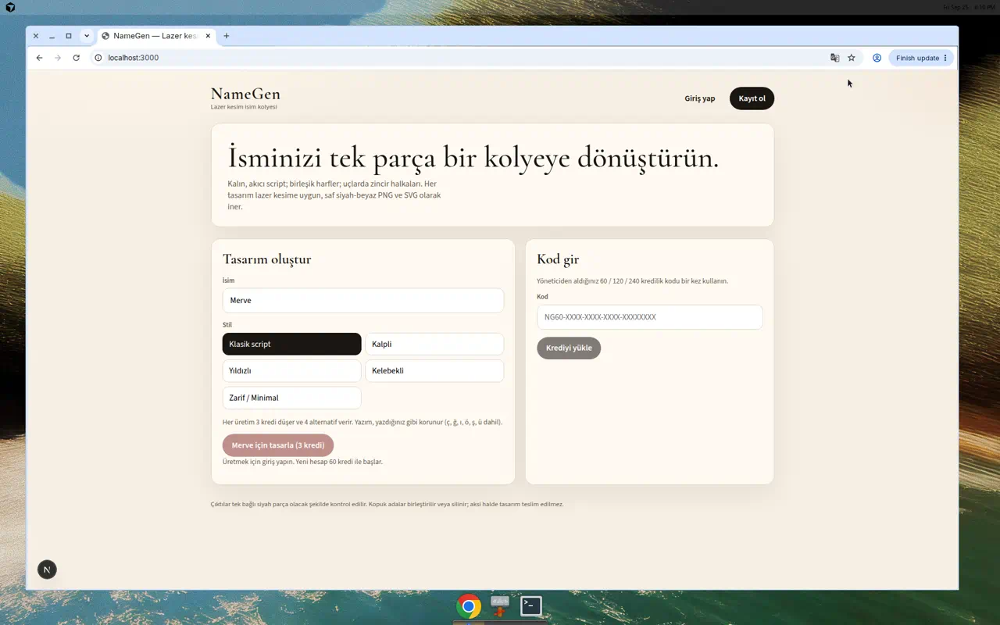 | 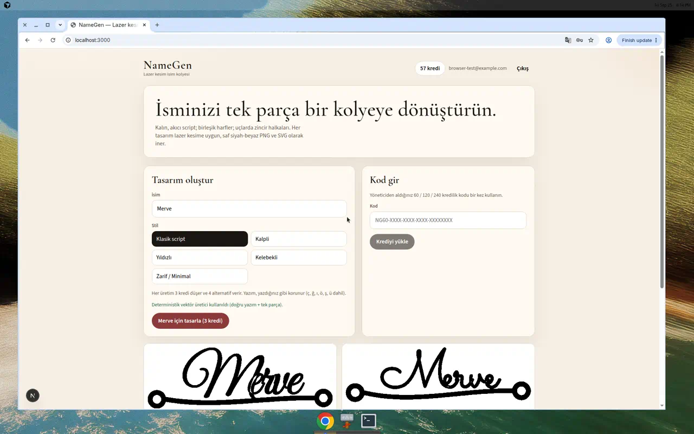 |
| **Admin kod** | **Kod yükleme** |
| 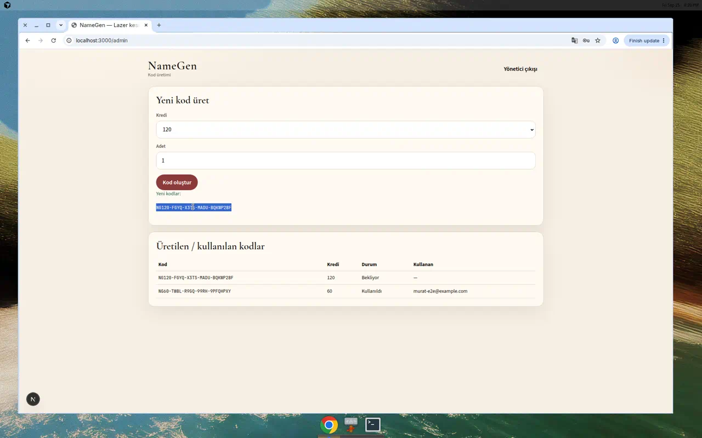 | 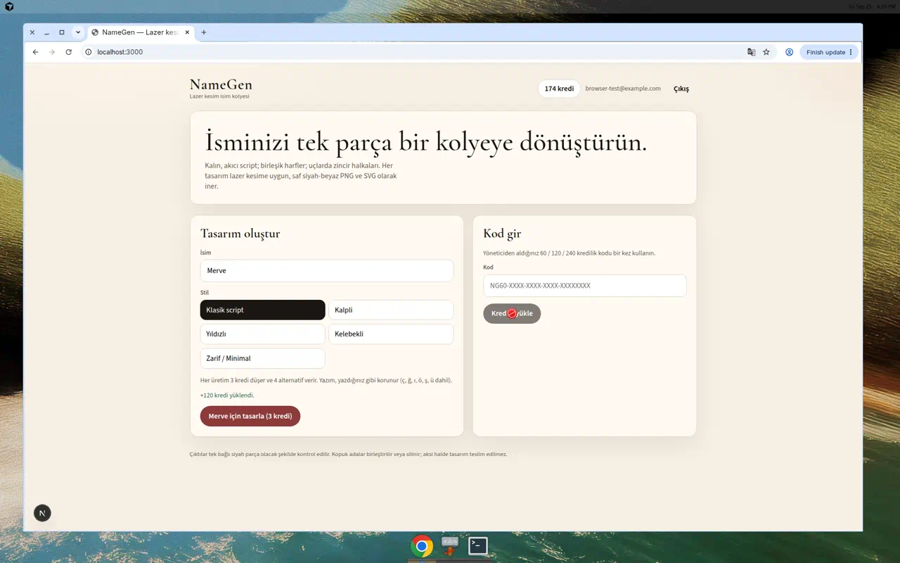 |
| **Admin Ayarlar (üretim + temel prompt)** | **Kategoriler (halka + son prompt)** |
| 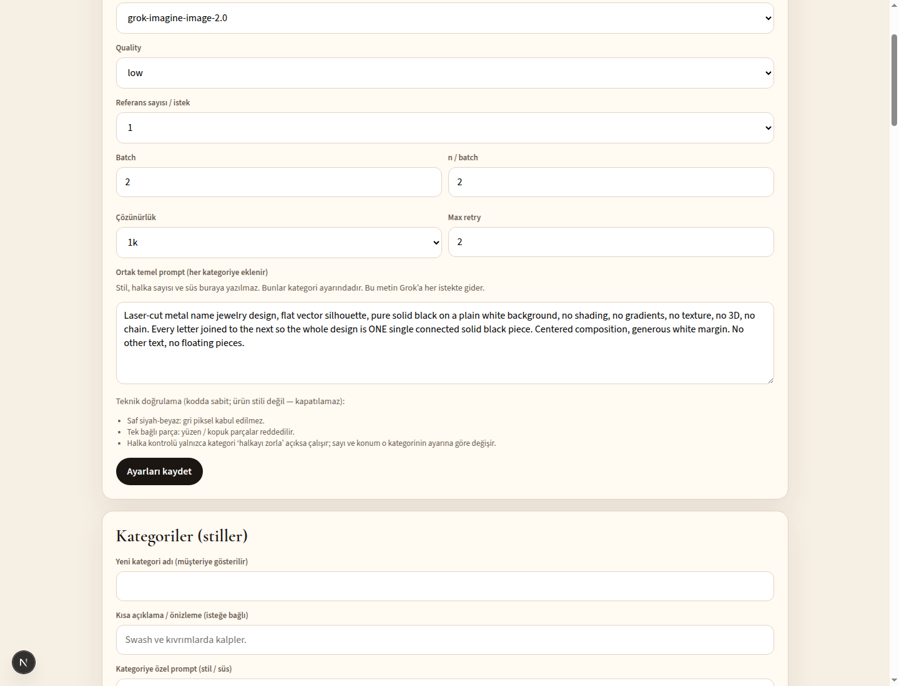 | 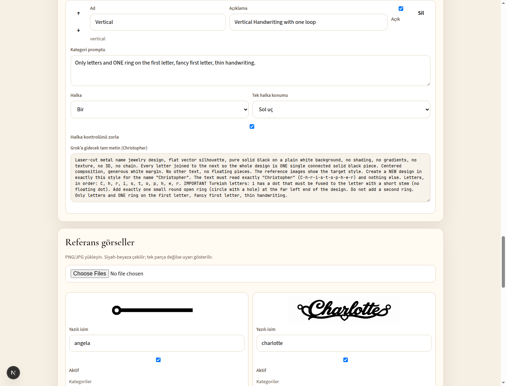 |
| **Referanslar** | **Müşteri stil seçici (DB)** |
| 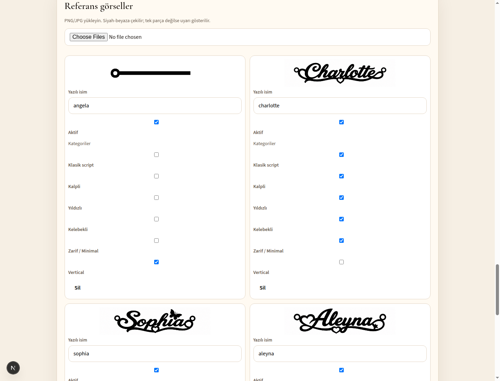 | 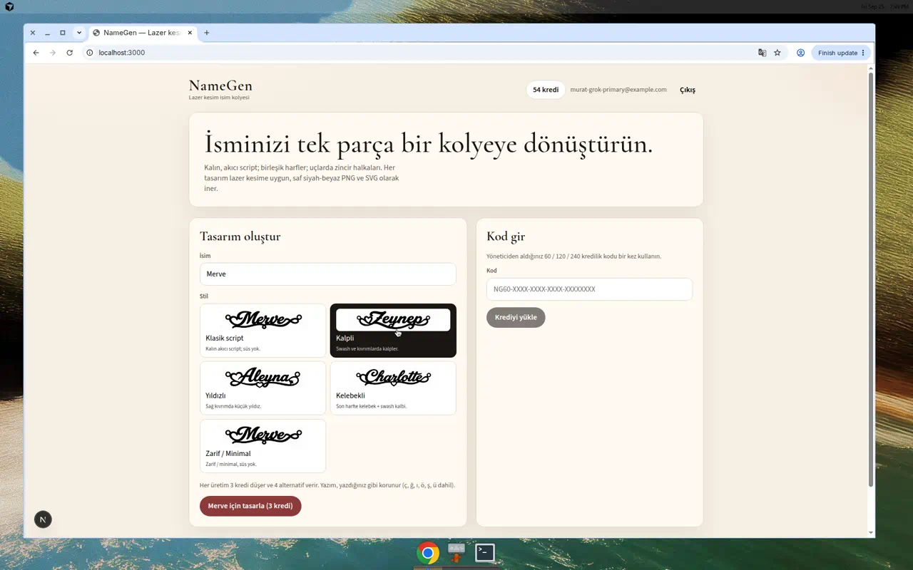 |
| **Üretim listesi (kategori + gönderilen ref)** | **Ana sayfa (sonuçlar sağ kart)** |
| 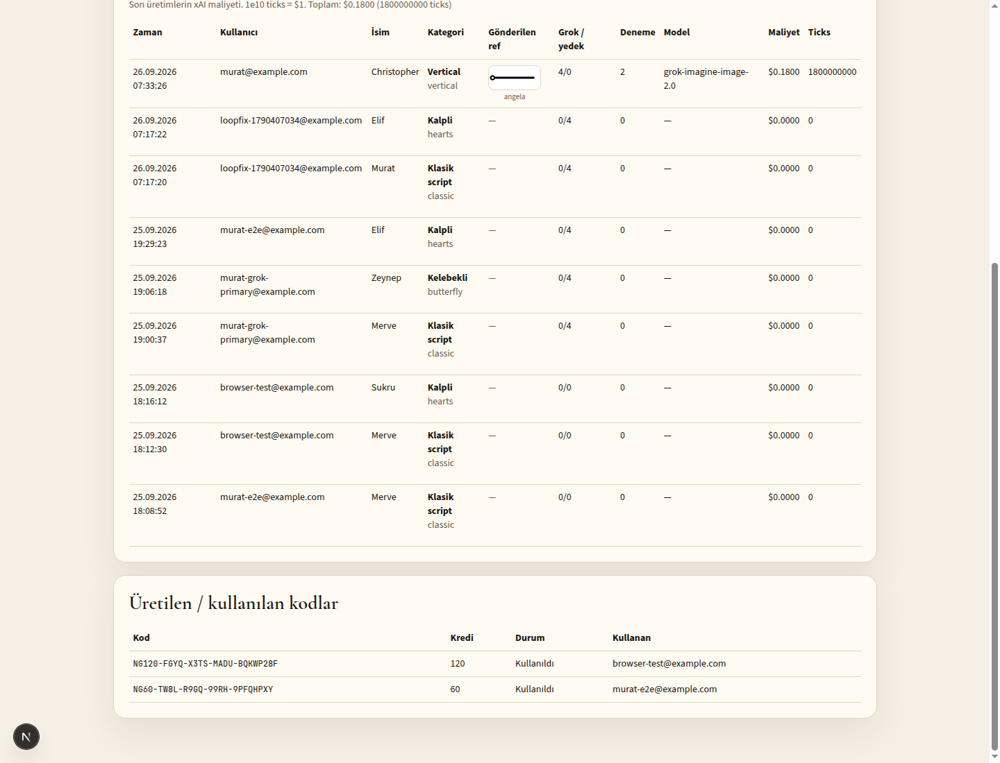 | 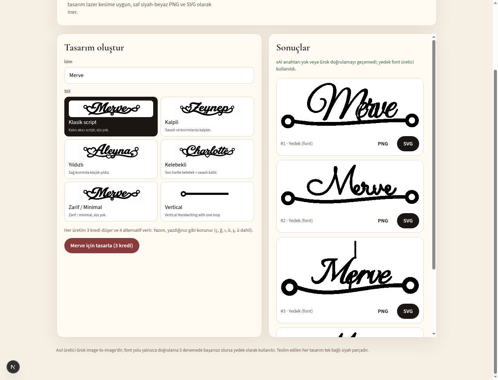 |
| **Kredi kodu penceresi** | **Başlangıç kredisi ayarı** |
| 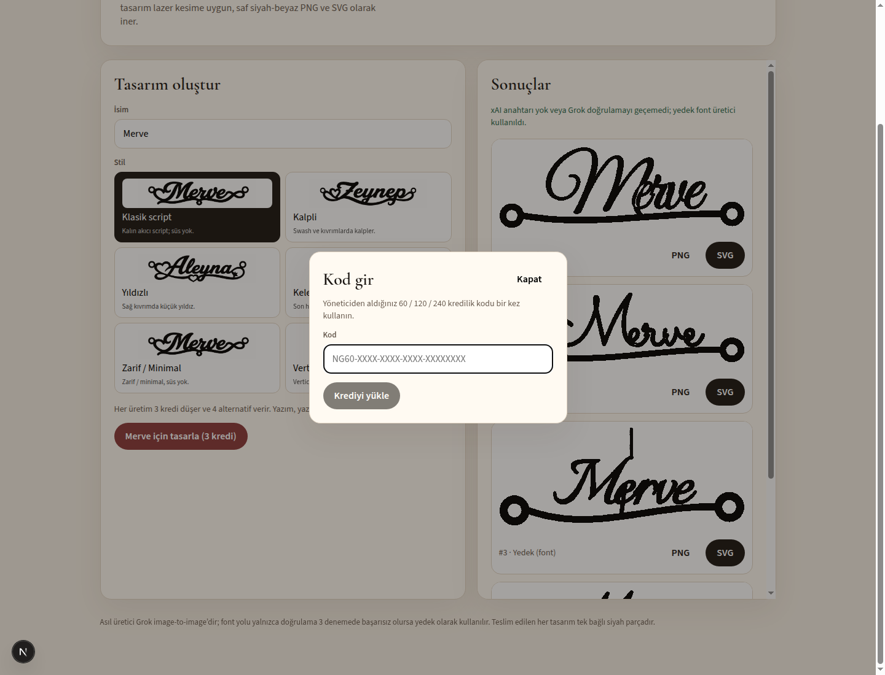 | 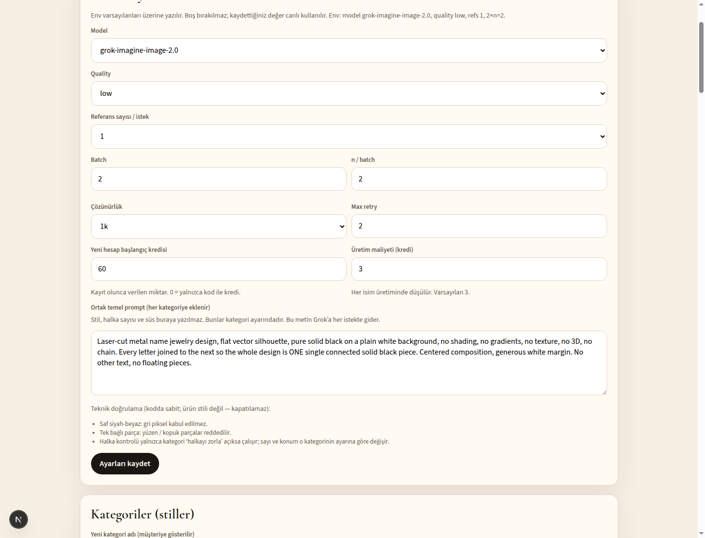 |

Aynı seti yeniden üretmek için: `npx tsx scripts/write-docs-samples.ts`

## Kredi sistemi

- Yeni hesap ve üretim maliyeti **admin Ayarlar**’dan düzenlenir (`startingCredits`, `generationCost`). Varsayılan 60 / 3. Başlangıcı 0 yapmak, kredi çiftliğini keser: kredi yalnızca koddan gelir.
- Bakiye ve fiyat **yalnızca sunucuda** geçerlidir. İstemci gönderdiği kredi / fiyat dikkate alınmaz (`/api/generate` yalnızca `name` + `style` alır; tutar `generationCharge()`).
- Üretim akışı: `spend(userId, "namegen", amount, idempotencyKey)` → Grok → tamamen başarısızsa `refund(spendId)`. Idempotency anahtarı her üretim isteğinde `crypto.randomUUID()` ile üretilir.
- `spend` atomiktir, bakiye yetmezse `INSUFFICIENT` fırlatır, aynı anahtar ikinci kez düşmez (`spendId` döner).
- Top-up: müşteri üstteki **kredi rozetine** tıklayınca açılan pencereden kod girer. Kodlar yalnızca **60 / 120 / 240** kredi taşır
- Kodlar HMAC-SHA256 ile `CODE_SECRET` kullanılarak imzalanır (`NG60-XXXX-XXXX-XXXX-XXXXXXXX`)
- Bir kod sistem genelinde **bir kez** kullanılabilir (unique + transaction)
- Admin UI (`/admin`) ve CLI kod üretir; admin üretilen/kullanılan kodları listeler

### Kredi arayüzü (`src/lib/credits/`)

NameGen ileride IdeaLaserStudio (repo `tyndreus1/idea-mark`) içinde bir özellik olacak; kredi birkaç özelliğin paylaştığı havuzdan gelecek. Route’lar ve UI yalnızca bu dört metoda bağlanır — yerel SQLite’ı HTTP istemcisiyle değiştirmek çağıranları değiştirmez.

```ts
export type CreditWallet = {
  getBalance(userId: string): Promise<number>;
  spend(userId: string, feature: string, amount: number, idempotencyKey: string): Promise<string>;
  refund(spendId: string): Promise<void>;
  redeem(userId: string, code: string): Promise<{ credits: number; added: number; code: string }>;
};
```

| Dosya | Rol |
|---|---|
| `types.ts` | `CreditWallet` + `NAMEGEN_FEATURE = "namegen"` |
| `local.ts` | Varsayılan: `User.credits` + `CreditSpend` defteri (atomik düşüm, unique `idempotencyKey`, `refund` `spendId` ile) |
| `remote.ts` | **STUB** — HTTP henüz yok. `CREDITS_PROVIDER=remote` bunu seçer; `CREDITS_API_URL` / `CREDITS_API_KEY` okunur, `fetch` yazılmamıştır |
| `index.ts` | `creditWallet` seçimi + `getBalance` / `spend` / `refund` / `redeem` |

`startingGrant()` ve `generationCharge()` admin ayarından okur. `CreditSpend` tablosu için `npx prisma db push` gerekir (yeni kurulum veya bu şema değişikliğinden sonra).

## Kurulum

Gereksinimler: Node.js 20+.

```bash
cp .env.example .env
# .env içinde CODE_SECRET, SESSION_SECRET, ADMIN_PASSWORD doldurun
# XAI_API_KEY ve isteğe bağlı XAI_* (model, ref count, quality, batches, n, resolution, retries)

npm install
npx prisma db push
npm run dev
```

Açılış: [http://localhost:3000](http://localhost:3000)

### Kod üretmek

```bash
# Veritabanına kaydeder (kullanılabilir hale gelir)
npx tsx scripts/generate-codes.ts --value 60 --count 3 --persist
npx tsx scripts/generate-codes.ts --value 120 --count 1 --persist
npx tsx scripts/generate-codes.ts --value 240 --count 1 --persist
```

Veya `/admin` sayfasından `ADMIN_PASSWORD` ile giriş yapıp kod üretin.

### Testler

```bash
npm run typecheck
npm test
```

`typecheck` (`tsc --noEmit`) tanımsız değişken gibi hataları yakalar; CI (`.github/workflows/ci.yml`) önce onu, sonra `npm test` çalıştırır.

Kapsam: kod imzalama/doğrulama, tek kullanımlık, kredi, bağlılık, Grok mock pipeline, kategori CRUD / referans yükleme / aynı-isim dışlama, örnek isim üretimi. xAI anahtarı testlerde kullanılmaz.

Örnek tasarımları diske yazmak:

```bash
npx tsx scripts/write-docs-samples.ts
npx tsx scripts/preview-designs.ts Merve Zeynep Şükrü
```

## Ortam değişkenleri

| Değişken | Zorunlu | Açıklama |
|---|---|---|
| `DATABASE_URL` | evet | Prisma SQLite, örn. `file:./dev.db` |
| `CODE_SECRET` | evet | Kod HMAC sırrı |
| `SESSION_SECRET` | evet | Oturum JWT sırrı |
| `ADMIN_PASSWORD` | evet | `/admin` şifresi |
| `XAI_API_KEY` | hayır | xAI / Grok edits + vision API |
| `XAI_IMAGE_MODEL` | hayır | `grok-imagine-image` / `grok-imagine-image-2.0` / `grok-imagine-image-quality` |
| `XAI_REF_COUNT` | hayır | `0` text-only, `1` (varsayılan) veya `2` edits |
| `XAI_QUALITY` | hayır | `low` (varsayılan) / `medium` / `high` — edits’e pinlenir |
| `XAI_BATCHES` | hayır | Çeşit istek sayısı; varsayılan `2` |
| `XAI_N_PER_BATCH` | hayır | İstek başına `n`; varsayılan `2` |
| `XAI_RESOLUTION` | hayır | `1k` (varsayılan) veya `2k` |
| `XAI_MAX_RETRIES` | hayır | Kalan slot retry turu; varsayılan `2` |
| `XAI_TEXT_MODEL` | hayır | Yazım kontrolü (vision); varsayılan `grok-4.6` |
| `REFERENCE_STORAGE_DIR` | hayır | Referans PNG dizini; varsayılan `data/references` (kalıcı olmalı) |
| `CREDITS_PROVIDER` | hayır | `local` (varsayılan, SQLite) veya `remote` (IdeaLaserStudio stub; HTTP yok) |
| `CREDITS_API_URL` | hayır | Gelecekteki paylaşılan kredi API tabanı; yalnızca `remote` için |
| `CREDITS_API_KEY` | hayır | Gelecekteki paylaşılan kredi API anahtarı; yalnızca `remote` için |

Sırlar asla commit edilmez. `.env` gitignore’dadır.

## Deploy

Next.js App Router. [Netlify](https://www.netlify.com/) için `netlify.toml` hazır (`@netlify/plugin-nextjs`).

**Önemli:** SQLite sunucusuz ortamda kalıcı değildir. Netlify / benzeri bir host’ta:

- `DATABASE_URL` için kalıcı bir Postgres (veya Turso/libSQL) kullanın, **veya**
- tek instance + kalıcı disk (Fly, Railway, VPS) üzerinde SQLite dosyasını tutun.

Netlify UI’da aynı env değişkenlerini tanımlayın. `XAI_API_KEY` yoksa Grok atlanır ve font yedeği kullanılır. `maxDuration` üretim rotasında 120s (4 × 2k edits + retry).

Yerel üretim derlemesi:

```bash
npm run build
npm start
```

## Font lisansları

`fonts/` altındaki script fontlar [SIL Open Font License](fonts/OFL.txt) ile gelir (Google Fonts: Great Vibes, Allura, Alex Brush, Sacramento, Parisienne, Tangerine, Italianno, Dancing Script).
